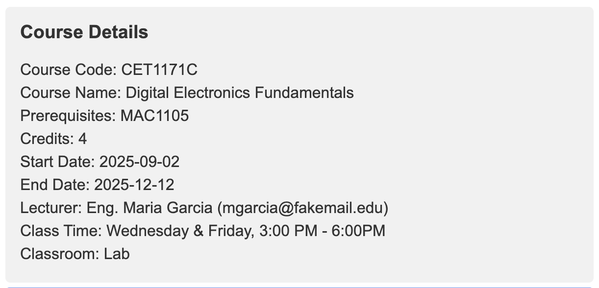
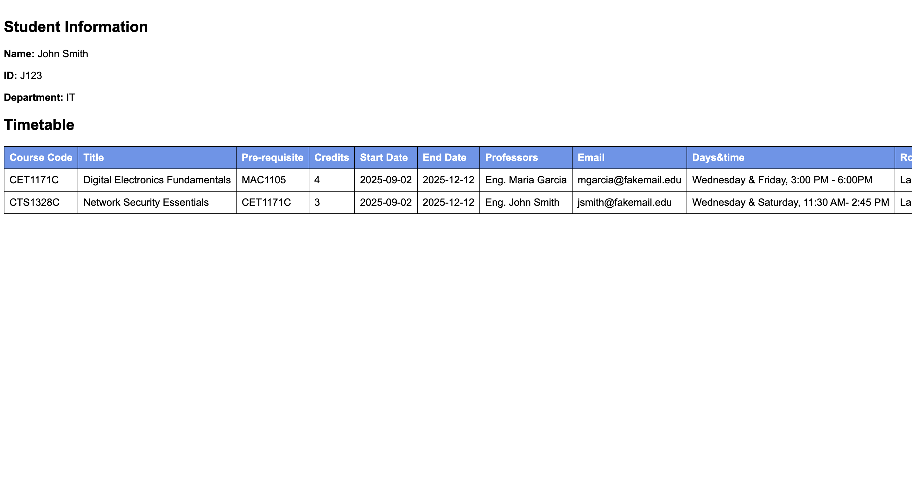

# 📝 Student Registration Form

A simple HTML-based student courses registration form that allows users to select courses and view course information in a summary.

## 📌 Features

- Collects basic student information: name, ID, and major
- Display courses based on the majors selected
- Allows course selection through checkboxes
- Displays course details on demand (via info buttons)
- Generates a registration summary with timetable after form submission

## 🖥️ Screenshots

### Main Registration Form

### Course Info Section

### Registration Summary

## 🛠️ Tech Stack

- HTML
- CSS
- JavaScript

